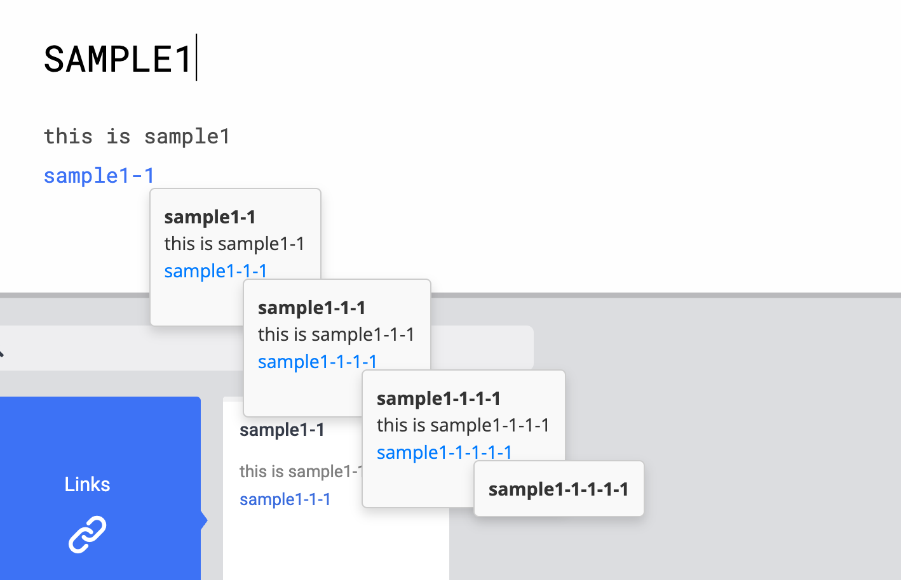

# Scrapbox Nested Link Preview

Scrapbox Nested Link Preview with Tampermonkey.



# Japanese

## 概要 (Overview)

* Scrapboxのページ内リンクにマウスカーソルを合わせると、リンク先のページのプレビューをポップアップで表示します。
* プレビュー内のリンクにホバーすると、もう一段階ネストしてプレビューを表示できます。
* ネストの段階はスクリプト内で設定できますが、上げすぎると動作に影響が起こる可能性があります。
* Google Chrome, Firefox, Brave ブラウザでの動作を確認しています。

## 機能 (Features)

* Scrapboxの内部リンクにホバーすると、リンク先ページのプレビューを表示します。
* プレビュー内容はAPI経由で取得され、スクロール可能です。
* プレビュー内の内部リンクにホバーすると、さらに1段階ネストしてプレビューを表示します（合計2つのプレビューウィンドウまで）。
* プレビューの表示/非表示の遅延時間などをスクリプト内で設定可能です。
* プレビュー内のリンク（内部リンク、外部リンク）はクリックして実際にページ遷移できます。

## インストール方法 (Installation)

1.  **ユーザースクリプトマネージャの導入:**
    お使いのブラウザに Tampermonkey をインストールしてください。

2.  **スクリプトの登録:**
    Tampermonkey にコードを貼り付けて保存し、スクリプトを有効化してください。

## 使い方 (Usage)

このユーザースクリプトはScrapboxのページ (`https://scrapbox.io/*`) で機能します。

* ページ内の内部リンクにマウスカーソルを合わせるとプレビューウィンドウが表示されます。
* プレビューウィンドウ内の内部リンクにマウスカーソルを合わせると、その近くに2つ目のプレビューウィンドウが表示されます。
* プレビューウィンドウからマウスカーソルを外すと、ウィンドウは自動的に非表示になります。
* プレビューウィンドウ上にマウスカーソルがある間は、ウィンドウは表示されたままになります。
* プレビューウィンドウ内のリンクはクリックしてページ遷移できます。

## 設定 (Configuration)

スクリプトファイルの先頭にある以下の定数を変更することで、動作を調整できます。

```javascript
// --- User Configurable Settings ---
const HOVER_DELAY = 250;      // プレビュー表示までの遅延 (ミリ秒)
const HIDE_DELAY = 200;       // プレビュー非表示までの遅延 (ミリ秒)
const CACHE_DURATION = 5 * 60 * 1000; // 取得したページデータのキャッシュ期間 (ミリ秒)
const MAX_NEST_LEVEL = 1;     // プレビューの最大ネストレベル (0: ネストなし, 1: 1段階ネスト)
// --- End of Settings ---
```

## 免責事項 (Disclaimer)

このユーザースクリプトは、**MITライセンス**に基づき提供されます。

* **無保証:** 制作者は、本スクリプトの動作、機能、正確性について一切の保証をいたしません。
* **自己責任:** 本スクリプトの利用は、全て利用者自身の責任において行ってください。利用によって生じたいかなる損害についても、作者は責任を負いません。
* **仕様変更リスク:** Scrapbox側の仕様変更により、本スクリプトは予告なく動作しなくなる可能性があります。

ご利用にあたっては、これらの点を十分にご理解ください。
